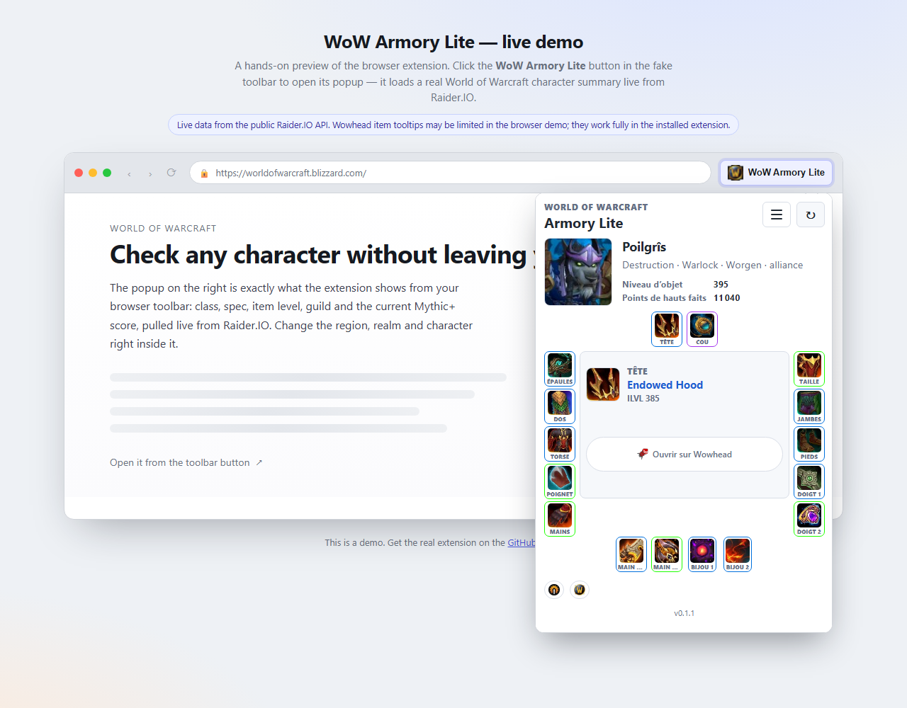

# WoW Armory Lite

A cross-browser WebExtension that brings your World of Warcraft character stats to your browser toolbar using the public Raider.IO API.
A rebuild inspired by the old Netvibes WoW Armory widget that disappeared with the shutdown of netvibes.com.

[](https://github.com/jmicaux/wow-armory/actions/workflows/ci.yml)     

**🔗 Live preview: [jmicaux.github.io/wow-armory](https://jmicaux.github.io/wow-armory/)**



If you enjoy this extension, you can support it:

[](https://buymeacoffee.com/jmicaux)

## Features

- **Toolbar popup** — region / realm / character form, no account needed.
- **Character summary** — class, spec, race, faction, guild, equipped item level,
  achievement points and current Mythic+ score.
- **Equipment breakdown** with Wowhead item tooltips.
- **Saved preferences** with `storage.sync`; profile responses cached for 30 minutes
  (with a short cooldown on forced refreshes), Wowhead item metadata for 14 days.
- **Official Armory fallback** — a direct link to the Blizzard profile when Raider.IO
  has no public data for the character.
- **Options page** and a single MV3 manifest that runs on both Chrome and Firefox.

## Install & usage

### Chrome / Chromium

1. Open `chrome://extensions`
2. Enable Developer mode
3. Click "Load unpacked"
4. Select this `wow-armory` folder
5. For packaged testing, use `dist/v0.1.1/chrome/wow-armory-lite-chrome.zip`

### Firefox

1. Open `about:debugging#/runtime/this-firefox`
2. Click "Load Temporary Add-on"
3. Select `manifest.json`
4. For packaged testing, use `dist/v0.1.1/firefox/wow-armory-lite-firefox.xpi`

## Packaging

Chrome and Firefox ship the same files (the manifest already includes
`browser_specific_settings.gecko`), so both builds have identical contents:

```
dist/v0.1.1/chrome/wow-armory-lite-chrome.zip     # load unpacked / Web Store
dist/v0.1.1/firefox/wow-armory-lite-firefox.xpi   # AMO / temporary add-on
```

See [CHANGELOG.md](CHANGELOG.md) for the version history.

## Project structure

```
wow-armory/
├── manifest.json         # MV3 manifest (Chrome + Firefox via gecko settings)
├── popup.html/.js        # toolbar popup UI and rendering
├── options.html/.js      # options page
├── shared.js             # Raider.IO fetching, settings and caching
├── browser-polyfill.js   # minimal browser API shim for Chrome
├── demo-shim.js          # localStorage storage shim for the web live preview
├── version.js            # shows the manifest version in the popup
├── styles.css            # popup and options styling
├── index.html            # live-preview page (GitHub Pages)
├── assets/               # icons and source favicons
├── dist/                 # packaged .zip (Chrome) and .xpi (Firefox)
└── README.md
```

## Data sources

- Character data comes from the public [Raider.IO](https://raider.io/) character
  profile API. No Blizzard API credentials are used.
- Item tooltips come from [Wowhead](https://www.wowhead.com/).
- When Raider.IO has no public data for the configured character, the popup falls
  back to a direct link to the official World of Warcraft Armory profile.

## License

Licensed under the [PolyForm Noncommercial License 1.0.0](LICENSE.md): you are free to fork,
modify and share this project **for noncommercial purposes**, as long as you keep the
attribution (`Required Notice: Copyright jmicaux`). Commercial use is not permitted.

## Credits

Data by [Raider.IO](https://raider.io/) and [Wowhead](https://www.wowhead.com/). This
extension is not affiliated with, endorsed by, or certified by Raider.IO, Wowhead or
Blizzard Entertainment. World of Warcraft is a trademark of Blizzard Entertainment, Inc.

Built with the help of [Claude](https://claude.ai/code).
